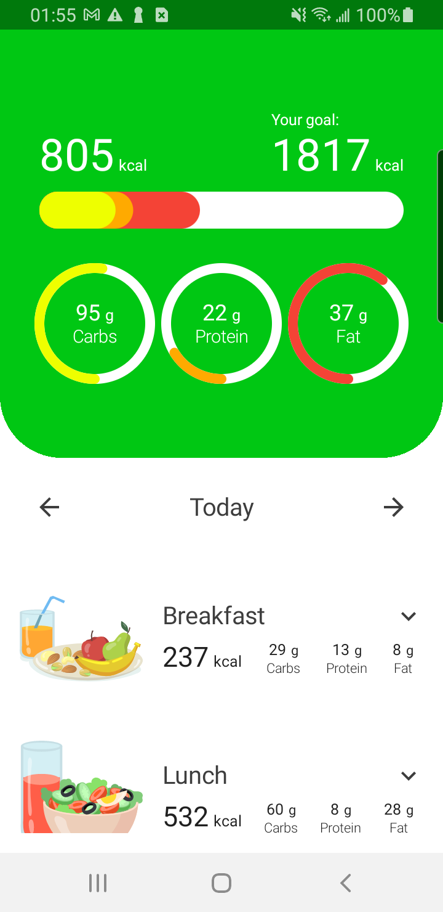
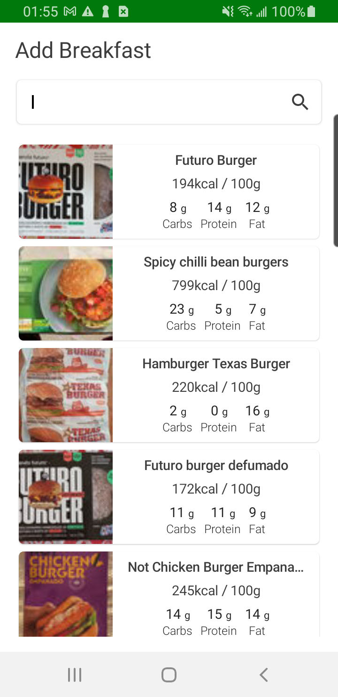

# Calory Tracker App
### Description
Calorie counter, which allows you to monitor the consumption of macro and micro nutrients during the main meals such as breakfast, 
lunch and dinner, by adding the foods consumed, foods that return from the API with the nutritional values.

# Project´s Structure
The project adopts a modular approach, organizing its features into distinct layers to enhance the build process and facilitate seamless collaboration among team members. 
By structuring the codebase in this manner, we effectively delineate responsibilities, mitigate potential conflicts, and adhere to the SOLID principles of software design.
This results in a scalable and maintainable codebase, enabling efficient testing procedures and ensuring the longevity of the project.

# Technologies used on this project

* Kotlin
* Compose Ui
* Retrofit
* Moshi
* Room DataBase
* Coroutines - Flow
* MockK
* Dagger Hilt
* Coil
* Android Sdk

# Special thanks

To **Philipp Lackner**, mentor and creator of this project, 
which was reproduced in his course **Building Industry-Level Apps With Multi-Module Architecture**."

 &nbsp;&nbsp;&nbsp;&nbsp;&nbsp;
